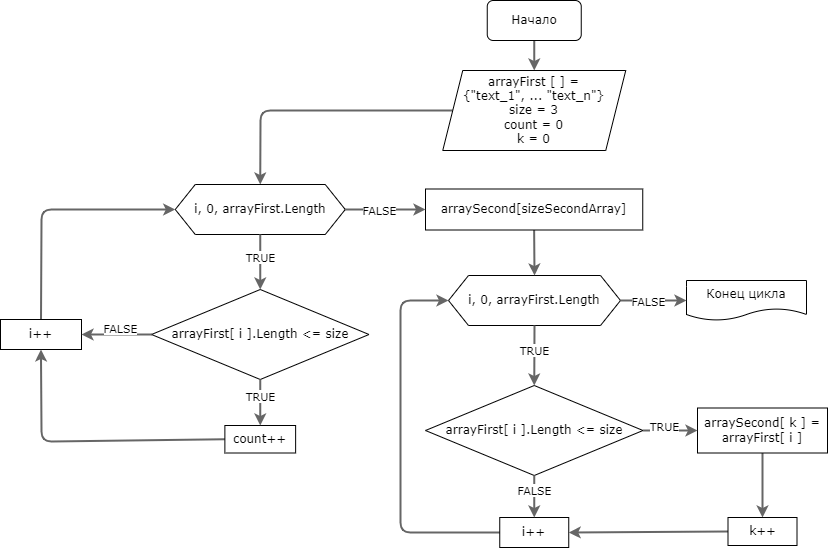

# Контрольная работа

## Описание
Итоговая контрольная работа

## Задание
Написать программу, которая из имеющегося массива строк формирует массив из строк, длина которых меньше либо равна 3 символа. Первоначальный массив можно ввести с клавиатуры, либо задать на старте выполнения алгоритма. При решении не рекомендуется пользоваться коллекциями, лучше обойтись исключительно массивами.

## Условие выполнения задания
1. Создать репозиторий на GitHub
2. Нарисовать блок-схему алгоритма (можно обойтись блок-схемой основной содержательной части, если вы выделяете ее в отдельный метод)
3. Снабдить репозиторий оформленным текстовым описанием решения (файл README.md)
4. Написать программу, решающую поставленную задачу
5. Использовать контроль версий в работе над этим небольшим проектом (не должно быть так что все залито одним коммитом, как минимум этапы 2, 3 и 4 должны быть расположены в разных коммитах)

## Описание решения
- Была создана блок-схема, описывающая основной метод решения

- Пишем код решения задачи
   1. Указываем первоначальный одномерный массив строкового типа непосредственно в коде.
   2. Описываем метод вывода одномерного массива
      + Метод описывает случай, когда выводим массив в независимости от того куда необходимо его вывести.
   3. Описываем метод согласно блок-схемы, являющийся непосредственно решением задачи:
      + На вход получаем первоначальный массив
      + Создаем вложеный метод для поиска количества элементов входного массива удовлетворяющие условию задачи
      + Создаем новый одномерный массив длинной полученой во вложенном методе
      + Далее получаем каждый элемент массива и его длинну
      + Сравниваем полученую длинну элемента массива с заданным количеством 3 символа
      + Если условие истина то добавляем в новый созданный массив.
      + По окончании работы метод возвращает массив из элементов удовлетворяющие условию задачи.

### Контролбная выполнена в 2022 году студентом Geek Brains
### &#169; Филиппенков Сергей